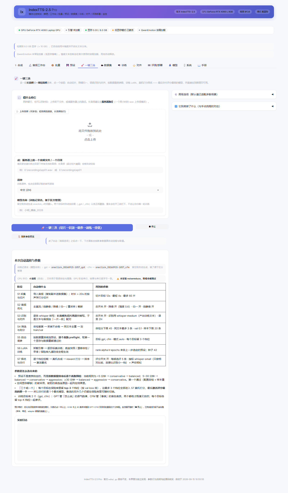

<div align="center">

<picture>
  <source media="(prefers-color-scheme: dark)" srcset="assets/indextts_icon_dark.png"/>
  
</picture>

# IndexTTS-2.5 Pro

**零样本语音克隆 · 一键三连全自动训练 · 可视化控制台 · LoRA 自训练 · DPO 偏好对齐 · A/B 自动评测 · 权重合并部署**

基于 [IndexTTS2](https://github.com/index-tts/index-tts) 构建的增强工程：模型与推理引擎一行不改，
为它补上一整套**网页控制台**和一条**完整的自训练流水线**。
从参考音频体检、单条合成、批量生产，到数据集构建、LoRA 训练、DPO 对齐、
自动评测、合并部署 —— 全部在一个浏览器页面里完成。

**最省事的入口是「🚀 一键三连」**：丢一段长音频或一堆短音频进去，点一个按钮，
它会自动切片、降噪归一、语音识别与对齐、按数据量挑参数、训练 LoRA、
真机打分择优，最后交付评分最高的模型并直接挂到推理页可用。

[](https://github.com/SrQingChen)
[](https://github.com/SrQingChen/IndexTTS-2.5-Pro)
[](https://github.com/index-tts/index-tts)
[](#4-环境要求)
[](#13-许可证)

[功能特性](#2-核心特性) · [界面预览](#3-界面总览) · [安装](#5-安装) · [快速上手](#6-快速上手) · [功能详解](#7-功能详解) · [自训练指南](#8-自训练指南从数据集到部署) · [测试验证](#9-测试与验证) · [FAQ](#10-常见问题-faq) · [许可证](#13-许可证)

</div>

---

## 目录

- [1. 项目简介](#1-项目简介)
- [2. 核心特性](#2-核心特性)
- [3. 界面总览](#3-界面总览)
- [4. 环境要求](#4-环境要求)
- [5. 安装](#5-安装)
- [6. 快速上手](#6-快速上手)
- [7. 功能详解](#7-功能详解)
- [8. 自训练指南（从数据集到部署）](#8-自训练指南从数据集到部署)
- [9. 测试与验证](#9-测试与验证)
- [10. 常见问题（FAQ）](#10-常见问题-faq)
- [11. 已知限制](#11-已知限制)
- [12. 项目结构](#12-项目结构)
- [13. 许可证](#13-许可证)
- [14. 致谢](#14-致谢)
- [15. 引用](#15-引用)
---

## 1. 项目简介

IndexTTS-2.5 Pro 是 [IndexTTS2](https://github.com/index-tts/index-tts) 的增强分支，由 [SrQingChen](https://github.com/SrQingChen) 开发维护。

上游提供了业界领先的零样本语音克隆**模型**。本项目不改模型，围绕它补齐工程侧最缺的两块能力：

1. **一个真正好用的可视化控制台。** 上游的 `webui.py` 是单页长表单，参数挤在一起、没有提示、没有工作流。本项目将其重构为 **12 个职责清晰的功能页**：每个参数都带悬停提示与参数手册，并新增参考音频工作台、批量生产、预设管理、模型下载、系统监控等页面。
2. **一条完整的自训练流水线。** 上游只有推理。本项目实现了 **LoRA 自训练（GPT 语气 + CFM 音色）→ DPO 偏好对齐 → 自动 A/B 评测 → 合并部署** 的完整闭环，并配有九道泛化保护防线，专门解决「微调完读错字、语气发飘」这类常见翻车。

**工程红线：** 官方 `webui.py` 一行未改，`indextts/` 推理引擎原样使用。本项目的全部改动都是新增文件，两个入口可以并存、互不干扰。

### 与上游的能力对照

| 能力 | 上游 IndexTTS2 | 本项目 |
|---|:---:|:---:|
| 零样本语音克隆 / 情感控制 / 多语言 | ✅ | ✅（引擎原样使用） |
| 模块化界面（12 个功能页） | ❌ 单页长表单 | ✅ |
| 逐参数提示 + 参数手册 | ❌ | ✅ 共用同一份参数注册表 |
| 参考音频体检 / 切片 / 降噪 / 音色库 | ❌ | ✅ 音频工作台 |
| 批量生产 + JSONL 驱动 | 部分 | ✅ 进度可视 + 打包下载 |
| 模型完整性审计 + 镜像优先下载 | ❌ | ✅ 模型资源页 |
| LoRA 自训练（GPT / CFM） | ❌ | ✅ 完整训练器 |
| DPO 偏好对齐 | ❌ | ✅ 偏好对构造 + 训练器 |
| 训练泛化保护 | ❌ | ✅ 九道防线 |
| 自动 A/B 评测（WER / 声纹相似 / reward） | ❌ | ✅ 评测台 + 逐条试听 |
| LoRA 合并回独立权重 | ❌ | ✅ 合并 + 强度可调挂载 |
| 拼音纠音辅助 | 手写标注 | ✅ 候选音列表 + 词表过滤 |

---

## 2. 核心特性

### 🚀 一键三连（全自动训练）

**整个项目最省事的入口。** 只需要给一段长音频或一堆短音频，点一个按钮：

| 阶段 | 自动做什么 |
|---|---|
| S1 采集与切片 | 导入音频；超过 20 秒的长音频按**声学打分**切成 8~15 秒片段（切点优先落在停顿处） |
| S2 音频优化 | 去直流 → 掐首尾静音 → 降噪 → 响度归一 → 重采样 → 截断，并给出「优化前 → 优化后」的体检分 |
| S3 识别与对齐 | whisper 逐条转写；长音频是**先切片再逐片转写**，于是「一片音频 ↔ 一段文本」按构造配对 |
| S4 筛选与划分 | 体检复算 → 丢掉不合格 → 同文本去重 → 划分 train / val（样本不足 20 条直接停下并说明原因） |
| S5 自动调参 | 按数据量排候选预设，**逐个真跑 preflight**（读数据、估显存、试划分），取第一个通过的 |
| S6 LoRA 训练 | 卸载引擎 → 逐目标真训练（默认 GPT + CFM）；九道泛化保护全程生效 |
| S7 择优与交付 | 把保险库里的 top-K 档位逐个**真机合成 + reward 打分**，排序后激活最优的那一个 |

关键设计：

- **「三个或一个」**：每个目标在保险库里保留 top-K（默认 3）个档位，它们全部进入真机打分，
  最后交付**评分最高的 1 个**（其余备选仍在保险库里可随时切换）。
  “取决于训练方式”的取舍也在这里：`top_k` 可调，GPT 与 CFM 各留各的。
- **参数不是拍脑袋定的**：候选配置要**真实通过预先运行**才能被采用，被拒的候选连原因
  一起列在报告里。评估间隔还会按真实步数反推 —— 让保险库真的能攒出 K 个可比档位。
- **按钮下方就能看到全部自动操作的参数**：开跑前显示「本次会自动操作什么、用什么值」，
  运行中显示阶段进度与实时日志，结束后显示完整的裁决报告（候选表 / 训练指标 /
  评分排名 / 推荐模型）。
- **八 GB 显存友好**：识别与优化不需要加载大模型；特征提取与择优加载引擎、训练卸载引擎，
  阶段之间自动错峰。训练期间会**禁止任何人加载引擎**，避免显存互踩导致的静默降速。

### 🎙 推理与生产

- **全参数可视化合成** —— 音色来源、文本语言（ZH / EN / JA / AR / ES）、情感控制、GPT 采样参数、分句与时长，全部图形化，每个参数都有悬停提示与手册说明。
- **情感控制** —— 支持 8 维情感向量（喜 / 怒 / 哀 / 惧 / 厌恶 / 低落 / 惊喜 / 平静）连续调节，也支持情感参考音频与情感文本描述。
- **读音标注纠音** —— 多音字用 `<字|拼音>` 标注即可精确控制读音（如 `银<行|HANG2>`），合成页可一键列出候选读音；英文支持音素标注、日文支持假名标注。
- **参考音频工作台** —— 体检打分、智能切片、降噪归一、音色库管理，把「选对参考音频」这件投入产出比最高的事做成可视化流程。
- **批量生产** —— 多行文本或 JSONL 任务文件驱动，每条任务可独立设置参考音频 / 情感 / 语言 / 参数；进度实时可见，结果打包下载。JSONL 格式与官方 `examples/batch/*.jsonl` 兼容。
- **预设管理** —— 参数快照保存 / 加载 / 删除，与官方 `webui.py` 互通。

### 🎓 自训练体系（本项目核心）

- **数据集构建** —— 创建 / 导入音频（拷贝入库，不怕源文件被挪）、补文本、train / val 可复现划分（同 seed 同结果）。
- **特征离线预提取** —— w2v-BERT / campplus / codec / mel / mu 全部离线算好缓存，训练时不再加载这些大模型，8 GB 显卡也能训练 813 M 参数的 GPT 底座；支持断点续提。
- **GPT（T2S）LoRA 训练器** —— 学「怎么说」：语气、节奏、停顿。
- **CFM（S2M）LoRA 训练器** —— 学「像谁」：音色、音质、频谱细节。
- **DPO 偏好对齐** —— 用当前模型批量合成候选 → whisper WER + campplus 声纹相似度自动打分 → 最优 / 最差成对构造偏好数据 → DPO 训练；margin 不足的对自动丢弃，不学噪声。
- **自动 A/B 评测** —— 两个配置同文本同种子各合成一遍，WER / 声纹相似 / reward 三指标胜负表 + 逐条试听，「像不像」用数据说话。
- **挂载与合并部署** —— adapter 可挂载到引擎并用**强度旋钮**（0 ~ 1.5）实时调节，不用重训就能在「像」和「稳」之间折中；试听满意后可把 ΔW 合并进独立的 `gpt.pth` / `s2mel.pth`，脱离训练目录使用。
- **九道泛化保护防线** —— 底座只读快照、参数预检、注入面收敛、权重漂移体检、早停、checkpoint 保险库、回放抗遗忘、强度旋钮、一键回滚（详见 [§8.8](#88-泛化保护九道防线)）。

### 🛡 工程质量

- **完善的调试日志**：`outputs/logs/` 下两个轮转文件 —— `indextts.log`（全量）与 `error.log`（只记问题，**含完整异常堆栈**）。主线程与子线程的未捕获异常都会落盘；UI 回调也被包装记录（Gradio 会吞掉回调里的异常，不包装就永远拿不到堆栈）。级别可运行期切换，界面「🖥 系统 → 调试日志」直接看。
- **全部功能有可复现的回归测试**：**15 套**回归与静态校验、**1250 项断言全部通过**，另有两份真机端到端验收（训练体系 33 项 · 一键三连 70 项），均见 [§9 测试与验证](#9-测试与验证)。
- **Windows 一键启动**：`start.bat` 自检虚拟环境 → 依赖 → 模型 → CUDA，缺什么明确提示，依赖缺失可一键补装。
- **镜像优先的模型下载**：hf-mirror 优先 + 三级回退，实时进度、断点续传、资源完整性审计。

---

## 3. 界面总览


顶栏是实时状态条：GPU 型号、引擎加载状态、显存占用、低显存模式、QwenEmotion 状态一目了然。主区上方为功能页导航，右侧提供可折叠的参数详解，鼠标悬停任意参数都有逐项提示。

### 12 个功能页

<table>
<tr>
<td width="50%"><br/><b>🎙 合成</b> —— 单条合成全参数：参考音频 / 文本语言 / 情感控制 / GPT 采样 / 分句时长，支持 <code>&lt;字|拼音&gt;</code> 读音标注</td>
<td width="50%"><br/><b>🔬 音频工作台</b> —— 参考音频体检打分、智能切片、降噪归一、音色库管理</td>
</tr>
<tr>
<td><br/><b>📦 批量</b> —— 多行文本 / JSONL 驱动，进度实时可见，结果可打包下载</td>
<td><br/><b>💾 预设</b> —— 参数快照管理，与官方 <code>webui.py</code> 互通</td>
</tr>
<tr>
<td><br/><b>🚀 一键三连</b> —— 丢进长音频或一堆短音频，一个按钮跑完切片 / 优化 / 识别对齐 / 自动调参 / 训练 / 择优；<b>按钮下方实时列出全部自动操作的参数</b></td>
<td><br/><b>🗂 数据集</b> —— 建集 / 导入 / 补文本 / train-val 划分 / 特征离线提取（断点续提）</td>
</tr>
<tr>
<td><br/><b>🎓 训练</b> —— GPT / CFM / DPO 三目标 LoRA 训练：预检 → 训练 → 保险库 → 记录</td>
<td><br/><b>⚖️ 对齐</b> —— 用当前模型批量合成候选、奖励打分、构造 DPO 偏好对</td>
</tr>
<tr>
<td><br/><b>🏁 评测/部署</b> —— A/B 对比、adapter 挂载与强度旋钮、合并成独立权重、泛化保护面板</td>
<td><br/><b>📥 模型</b> —— 资源审计 + 镜像优先三级回退下载，实时进度、可断点续传</td>
</tr>
<tr>
<td><br/><b>🖥 系统</b> —— 显存监控、环境体检、事件日志、缓存维护</td>
<td><br/><b>📖 手册</b> —— 架构原理、全部参数逐项说明（含训练与一键三连的全部旋钮）、场景配方、故障排查</td>
</tr>
</table>

> 「🎙 合成」页里还内嵌了一块 <b>LoRA 音色模型</b> 面板：直接选训练记录与档位、
> 调强度旋钮、挂载/卸载，挂上之后照常点「生成」就是那个音色。

> 截图由 `tools/ui_screenshots.py` 自动生成（走 Chrome CDP，无额外依赖），界面改版后重跑一次即可刷新。

---

## 4. 环境要求

| 项目 | 要求 | 说明 |
|---|---|---|
| 操作系统 | Windows 10 / 11（主要测试平台）；Linux 亦可 | `start.bat` 仅限 Windows，Linux 用 `uv` 手动流程 |
| GPU | NVIDIA，显存 ≥ 8 GB（推荐） | 已在 RTX 4060 Laptop 8 GB 上完整验收；无 CUDA 时回退 CPU，速度慢 |
| 磁盘 | ≥ 25 GB 可用空间 | 环境 5~8 GB + 模型 7.9 GB + 数据 / 输出 |
| Python | 3.10 或 3.11 | 由 `uv` 自动管理，无需手动安装 |
| 包管理 | [uv](https://docs.astral.sh/uv/) | `pip install uv` 即可安装 |

---

## 5. 安装

### 5.1 Windows 一键启动（推荐）

```bat
:: 双击根目录的 start.bat，或在本目录执行：
start.bat
```

`start.bat` 会依次自检 **虚拟环境 → Python 依赖 → 模型文件 → CUDA**：

- 缺虚拟环境 / 依赖时，给出明确的修复命令，依赖缺失时可直接用 uv 一键补装；
- 缺模型时提示先去 WebUI「模型」页下载，或用命令行下载；
- 全部就绪后启动控制台并自动打开浏览器（`http://127.0.0.1:7860`）。

支持参数透传：`start.bat --lazy`、`start.bat --port 7861`、`start.bat --host 0.0.0.0`。

### 5.2 手动安装（Windows / Linux 通用）

```bash
# 1) 克隆仓库
git clone https://github.com/SrQingChen/IndexTTS-2.5-Pro.git
cd IndexTTS-2.5-Pro

# 2) 创建环境（首次约 5~8 GB：Python + torch/CUDA + 依赖）
uv sync --extra webui

# 3) 下载模型（约 7.9 GB，镜像优先，可断点续传）
uv run tools/model_fetcher.py --version 2.5 --all

# 4) 启动
uv run webui_pro.py          # 本项目：11 页控制台
uv run webui.py              # 上游：单页界面（原样保留，可对照使用）
```

> **为什么是 `--extra webui` 而不是 `--all-extras`**：后者还会拉 `deepspeed` / `flash-attn` / `torch_compile`，需要 CUDA 工具链且本项目并不依赖。`peft`（LoRA 训练）与 `pypinyin`（拼音纠音）已写进基础依赖，`uv sync` 就会带上。

### 5.3 模型下载

三种方式任选：

1. **WebUI「模型」页**（推荐）—— 资源审计 + 实时进度 + 断点续传，缺什么一目了然；
2. **命令行** —— `uv run tools/model_fetcher.py --version 2.5 --all`；
3. **手动放置** —— 解压到 `checkpoints/` 目录，模型页会自动审计完整性。

下载走 `hf-mirror.com` 镜像优先并自动回退官方源，国内网络友好。

### 5.4 常用启动参数

```bash
uv run webui_pro.py --lazy              # 不预加载模型，秒开界面（首次合成时再加载）
uv run webui_pro.py --host 0.0.0.0      # 局域网访问
uv run webui_pro.py --port 7861         # 换端口
uv run webui_pro.py --help              # 查看全部参数
```

---

## 6. 快速上手

第一次使用，三分钟即可出声：

1. **启动** —— 双击 `start.bat`（或 `uv run webui_pro.py`），浏览器自动打开控制台。
2. **选音色** —— 进入「🎙 合成」页，在「音色来源」上传一段参考音频（建议 5~15 秒、干净人声、无背景音乐），或从音色库选择已有音色。
3. **输入文本** —— 在文本框输入要合成的内容，语言选 `auto` 自动检测即可。
4. **生成** —— 点击「生成」，等待数秒，试听并下载。

进阶提示：

- 想控制情感 → 展开「情感控制」，拖动 8 维情感向量，或上传一段「情感参考音频」；
- 遇到多音字读错 → 用 `<字|拼音>` 标注，如 `他在银<行|HANG2>里工作`；合成页的「读音助手」可列出候选读音一键插入；
- 想批量生产 → 去「📦 批量」页，粘贴多行文本或上传 JSONL 任务文件；
- 想系统性了解每个参数 → 读内置「📖 手册」，架构原理、逐参数说明、场景配方、故障排查都在里面。

---

## 7. 功能详解

### 7.1 一键三连（全自动训练）

「🚀 一键三连」页把整条流水线压成一个按钮。**两种输入可以同时给**：

1. **上传控件** —— 拖若干音频进去，适合一堆短音频；
2. **服务器路径** —— 填一个音频文件（长音频，比如整期播客）或一个目录（递归找全部音频）。
   长音频建议走这条：两小时的 wav 通过浏览器上传要先做临时副本再拷进数据集。

点击按钮后的七道工序见 [§2 核心特性](#-一键三连全自动训练)。使用要点：

**按钮下方的面板显示什么**

| 时机 | 面板内容 |
|---|---|
| 开跑前，或改完选项点「📋 刷新参数预览」 | 七个阶段各自会**自动操作哪些参数**、当前取值、候选预设顺序、以及「三个或一个」的取舍规则 |
| 运行中 | 阶段进度表（含每阶段耗时与结果）＋ 自动调参裁决表（哪些候选被拒、为什么）＋ 实时日志 |
| 结束后 | 完整裁决报告：候选配置表、训练指标、真机评分排名、推荐模型与后续操作指引 |

**自动调参是怎么定的**

1. 按数据量排出候选预设顺序（依据 `guard.PRESET_NOTES` 的出厂建议）：
   少于 5 分钟首选保守档；5~30 分钟首选均衡档；30 分钟以上才把激进档放进候选。
2. 按顺序**逐个真跑 `preflight()`** —— 读元数据、建样本池、估算显存、校验注入面。
3. 取第一个「配置自检 + 样本量 + 空闲显存」都通过的；被拒的候选连原因一起记进报告。

评估间隔还会按真实步数反推（`eval_every = max(1, 总步数 ÷ (K+1))`）：
小数据集上预设的 50/100/200 整个 run 都触发不到，保险库就只会剩下 1 个档位，
「留 K 个档位再择优」会变成没得选。

**样本不足会怎样**

筛选后不足 20 条时会**立刻停下并说明原因**（而不是跑到训练器里才炸），
同时给出行动建议（多录几段 / 调低体检分门槛 / 把切片时长调小以切出更多片段）。

**中断与续跑**

随时可以「⏹ 停止」，已完成的阶段不会白跑 —— 数据集、离线特征、adapter 都留在磁盘上。
想接着做可以到「🗂 数据集」页继续（特征提取支持断点续提），或到「🎓 训练」页自己配参数。

**长音频切片：会慢，但你随时能看出它在动**

切片是整条流水线里最慢的**单点**：要先把整段音频解码，再逐帧统计能量，
然后在全时长上滑窗评分（1 小时音频按 1 秒步长就是几千次评分），最后逐片写盘。
以前的实现有两个问题，都已修：

1. **内存不再随时长膨胀。** 帧能量统计原先是「一次性物化索引矩阵」——
   按 10 ms hop、25 ms 窗算，1 小时 48 kHz 音频光索引就要 ~3.5 GB，
   再加上切片与 float64 转换，峰值约 **8.6 GB**。表现就是机器开始颠簸、
   界面看着像卡死。现在改成分块计算，单块索引被钉在 ~40 MB，**与音频时长无关**，
   而且结果与原来**逐位相同**（`tools/oneclick_probe.py` 里有对账）。
2. **全程有进度、随时能停。** 切片链路上每一步都会报进度：

   ```
   读取音频 ep01.wav
   已解码 397 秒，开始统计帧能量
   帧能量 18148/39763
   寻找切分点 96/387（96/397 秒）
   写出片段 12/34（128.0~138.0s，评分 91）
   ```

   并且 `should_stop` 一路传到了解码 / 帧能量 / 窗口搜索 / 逐片写出，
   所以「⏹ 停止」会很快生效，不会等整条音频切完。

3. **源文件只解码一次。** 裁剪片段原先每片都重新解码一遍**整个源文件** ——
   598 秒的素材切 109 片就是 110 次全量解码，仅解码就要约 163 秒（这也解释了一次
   实测：切片阶段耗时 282 秒）。现在整段解码一次、逐片在内存里裁切，
   **同样的 109 片只要 2.2 秒**。

进度行按**限流**的方式写进日志（最多每 5 秒一条 INFO，其余进 DEBUG）：
每条都写会刷屏，全压到 DEBUG 又会让常规级别下「几分钟一条都看不到」。

另外还有一层**心跳**兜底：只要某个阶段超过 12 秒没有新进度，日志里就会按
INFO 打一条「…仍在进行 · 阶段 X · 已静默 N 秒 · 最后进度：…」——
静默本身也是信息，它把「长音频在算」和「真的卡住」分开。
这条心跳同时写进 `outputs/logs/indextts.log`，所以**事后**也能回看
（界面上的进度只存在内存里，进程一退就没了）。

> 顺带一提：判断「这条算不算长音频」现在只读文件头（`probe_duration`），
> 不再为了拿个时长去做整段解码 —— 那一步在超长音频上同样是几十秒的浪费。

**GPU 阶段之间会显式卸模型、清显存**

这是另一个实测踩出来的坑：应用启动会自动加载推理引擎（**4.94 GB**），如果进
流水线时不卸，它会一直占着；到识别阶段再叠一个 whisper medium（1.6 GB），8 GB 卡
只剩几百 MB，Windows 把计算挤进共享内存 —— 转写被**静默**拖慢 20~30 倍。
日志里的样子是「第一条音频转了 4 分钟还没完」，只有心跳在刷。

现在的做法（对着三个 CPU 阶段与两个 GPU 阶段分开处理）：

| 时机 | 动作 |
|---|---|
| 进流水线（采集/优化/识别全是 CPU 的活） | **卸掉引擎** + 清显存 |
| 识别开始前 | 再确认一次引擎是卸着的（你可能在别的页面手动加载过） |
| 识别结束 | 立刻卸载 whisper 并报告释放了多少 |
| 特征提取前 / 择优评测前 | 先清显存再加载引擎 |
| 加载 whisper / 引擎 | 加载前统一走一次 `guard.free_vram()`（gc → empty_cache → ipc_collect），并把「空闲 X → Y GB」写进日志 |

`free_vram` 只能把**已经释放**的块还给驱动，所以真正起作用的是「先把用不到的
模型卸掉」；清理是配套的收尾。两者都做了，识别阶段才是独占显存的。

**模型名称（便于区分管理）**

按钮上方的「模型名称」决定训练记录叫什么叫 —— 填 `小明_播客` 就能在
`training_runs/` 与推理页的 LoRA 列表里一眼认出它。

- 单个目标：直接用你填的名字（所见即所得）；
- 两个目标：自动加 `_gpt` / `_cfm` 后缀 —— 否则 CFM 会把 GPT 的记录目录覆盖掉；
- 留空：自动生成 `oneclick_<时间戳>`；
- **重名会在开工前拦下**（连同冲突的记录名一起告诉你），
  而不是让你等切片、识别、特征提取全跑完才在训练器里发现；
- 名称里的非法字符（`/ : * ? " < > |`）会被安全化并给出一条 warn。

**CPU 并行（只作用于 CPU 阶段）**

音频体检与增强是**纯 CPU、逐条独立**的计算，所以可以并行而且**结果与串行逐字节一致**
（`tools/oneclick_probe.py` 里有 1 线程 vs 4 线程的输出哈希对账）。

| | 说明 |
|---|---|
| 默认线程数 | `min(4, CPU核数÷4)`，本机 20 核 → 4 线程 |
| 为什么不更多 | 训练与推理也要抢 CPU，音频处理只是辅助工序 |
| 怎么关 | 「CPU 并行线程数」设 1 = 纯串行，与旧行为完全一致 |

**GPU 阶段一律串行，绝不会被并行碰到**：特征提取要借引擎的大模型做前向，
择优要往引擎上挂 adapter —— 引擎既不是线程安全的，同一时刻也只能挂一个
adapter，并行只会拿到错的特征或互相覆盖候选。

**耗时大致构成**

音频优化与识别按样本数线性增长；训练占一半以上；择优要逐候选合成再打分。
8 GB 卡上 30 条样本跑 GPT + CFM 双目标，量级在十几分钟起。

### 7.2 语音合成

单条合成的主战场，参数分五组：

| 参数组 | 内容 |
|---|---|
| 音色来源 | 上传参考音频 / 音色库选择；参考音频推理时取**前 15 秒**，开头质量最关键 |
| 文本与语言 | 文本输入 + 语言选择（auto / ZH / EN / JA / AR / ES）；支持 `<字\|拼音>`、`<word\|phoneme>`、`<漢字\|かな>` 读音标注 |
| 情感控制 | 8 维情感向量（喜 / 怒 / 哀 / 惧 / 厌恶 / 低落 / 惊喜 / 平静）/ 情感参考音频 / 情感文本描述三种方式 |
| GPT 采样 | temperature、top_p、top_k、重复惩罚等，控制稳定性与多样性 |
| 分句与时长 | 自动分句开关、时长因子（语速快慢） |

示例文本（内置「示例」区可直接载入）：

```
中文 · 多音字标注：他在银<行|XING2>里<行|HANG2>走了半天，发现这笔业务办不<行|HANG2>。
英文 · 音素标注：He had a <minute|M IH1 . N AH0 T> to examine the <minute|M AY0 . N UW1 T> details.
日语 · 假名标注：彼は料理が<上手|じょうず>だが、囲碁では<上手|うわて>に負けた。
```

### 7.3 LoRA 音色模型（推理页内嵌）

合成页里有一块 **LoRA 音色模型** 面板，用来挂载自训练出来的 adapter ——
不用切到别的页面，选好模型直接点「生成」即可：

| 控件 | 作用 |
|---|---|
| 训练记录（run） | 下拉框直接读 `training_runs/`，**只列出已经产出 adapter 的记录**（训练失败的不会出现，避免误选后报错） |
| 档位 | `best` = 该 run 表现最好的一档（训练器每次改善都会同步过去）；也列出保险库里的具名档位与 `final` |
| 强度 | 0~1.5 实时生效：0 = 纯底座，1 = 完整 LoRA，0.6~0.8 是「像」与「稳」的常见折中 |
| 挂载 / 卸载 | 手动控制；引擎未加载时会自动先加载 |
| 状态栏 | 显示当前挂着哪些 adapter、各自的实际强度 |

两个细节值得知道：

- **选了什么就会用什么**：点「生成」时如果下拉框选的模型与引擎上挂的不一致，
  会自动先挂上再合成（选择变化才重挂，不会每次生成都重读一遍权重文件）。
- **卸载时机**：卸载引擎会连带清掉 LoRA（引擎上的 adapter 随之消失），
  面板与状态条会同步回到「纯底座」，不会出现「显示已卸载但 LoRA 还在生效」的假象。

> 训练完想调强度或合并成独立权重，到「🏁 评测/部署」页；那里还有 A/B 对比与泛化保护面板。

### 7.4 读音标注（拼音纠音）
- 输入 `<字|拼音>` 后合成时按指定读音发音，解决多音字 / 生僻字 / 专有名词读错的问题；
- 「读音助手」基于词表给出候选读音列表，点击即插入，不用手查拼音；
- 英文支持 ARPABET 音素标注，日文支持假名标注，规则同官方引擎。

### 7.5 参考音频工作台

IndexTTS-2.5 是零样本 TTS，音色几乎完全由参考音频决定（CAMPPlus 声纹 + w2v-BERT 情感特征 + ref_mel 声学模板三路注入）。把参考音频选对、处理好，往往比训练 LoRA 更有效、更零风险。

流程：**上传 → 体检打分 → 智能切片 → 增强处理 → 入库 → 合成页直接调用**

- **体检打分**：每个指标对应推理链路里的一个真实约束（并非泛泛的「音质好不好」），例如官方推理只取前 15 秒，所以开头静音 / 噪声会直接吃掉有效信息；
- **智能切片**：从长音频里自动切出质量最佳的片段；
- **降噪归一**：一键增强处理；
- **音色库**：处理好的参考音频入库管理，合成页 / 批量页 / JSONL 任务均可引用。

### 7.6 批量合成

两种输入：

1. **多行文本** —— 一行一条，共用界面上的全局参数；
2. **JSONL 任务文件** —— 一行一个 JSON 对象，**只有 `text` 必填**，其余字段缺省时继承全局设置：

```jsonl
{"text": "第一段文本"}
{"text": "第二段", "lang": "EN", "spk_audio_prompt": "voice_bank/audio/host_a.wav"}
{"text": "第三段", "emo_control_method": 2, "emo_vector": [0,0,0.7,0,0,0,0,0]}
{"text": "第四段", "duration_factor": 1.2, "temperature": 0.7, "seed": 42}
```

进度实时可见，完成后可打包下载全部音频。格式与官方 `examples/batch/*.jsonl` 兼容。

### 7.7 预设管理

把当前合成参数存成命名快照，随时载入 / 删除。预设文件与官方 `webui.py` 互通——在官方界面保存的预设，本项目同样能用。

### 7.8 模型管理

- **资源审计**：逐项检查主模型与辅助模型（w2v-BERT、campplus、semantic codec、BigVGAN 等）是否就位；
- **镜像优先下载**：hf-mirror 优先 + 三级回退，实时进度、断点续传；
- 缺模型时明确告诉你缺哪个，不会到合成时才报错。

### 7.9 系统监控 · 调试日志 · 参数手册

- **🖥 系统**：显存实时仪表、环境体检、事件日志、缓存维护；引擎可一键加载 / 卸载（8 GB 显存错峰必备）。
- **📖 手册**：架构原理（GPT / CFM / 情感三路注入）、全部参数逐项说明、场景配方、故障排查。手册与控件提示共用同一份参数注册表，界面与文档永不打架。

---

## 8. 自训练指南（从数据集到部署）

### 8.1 流程总览

```
L1  SFT LoRA       GPT(T2S) 学「怎么说」—— 语气、节奏、停顿
                   CFM(S2M) 学「像谁」  —— 音色、音质、频谱细节
                        ↓
L2  DPO 偏好对齐    同一句话合成多个候选 → 打分 → 好的当 chosen、差的当 rejected
                        ↓
L3  评测与落地      A/B 自动对比（WER / 声纹相似 / reward）→ 调强度 → 合并部署
```

对应到界面就是四个页面的接力：**🗂 数据集 → 🎓 训练 → ⚖️ 对齐 → 🏁 评测/部署**。

> **不想手动走这四步？** 「🚀 一键三连」把 8.2~8.7 里的自动化部分全做完了
> （导入、切片、优化、识别补文本、划分、特征提取、选参数、训练、择优、激活），
> 而且调的是**同一套后端函数**，没有另起一套逻辑。
> 下面这一章仍然值得读 —— 它是理解「方法为什么有效」的依据，
> 也是手工微调（比如只想换某个超参、只想训 CFM）时的操作手册。

### 8.2 第一步：构建数据集（数据集页）

1. **创建数据集** —— 命名并创建（落盘在 `datasets/<名称>/`）；
2. **导入音频** —— 支持从任意路径导入，文件会**拷贝**进数据集目录，训练几小时也不怕源文件被挪；
3. **补文本** —— 每条音频补上对应文本（特征提取的硬前提：没有文本就没有 text_tokens / mu）；
4. **音频体检** —— 每条音频自动体检，全部 ready 才建议进入下一步；
5. **train / val 划分** —— 按比例划分，同 seed 结果可复现。

数据来源建议：本人录音、引擎批量合成（「批量」页正好用上）、或两者混合。

### 8.3 第二步：特征预提取（数据集页）

点击「特征提取」，后台线程自动完成 w2v-BERT / campplus / codec / mel / mu 的离线提取与缓存：

- 训练时**完全不加载**这些大模型 —— 这是 8 GB 显卡训得动 813 M 底座的关键；
- 支持进度显示、中断、**断点续提**；
- 提取需要引擎里的前向模块，引擎未加载时会自动加载。

### 8.4 第三步：LoRA 训练（训练页）

**先想清楚练哪个目标**——两个目标决定的东西不同：

| | GPT (T2S) | CFM (S2M) |
|---|---|---|
| 决定 | 「怎么说」语气、韵律 | 「像谁」音色、音质 |
| 参数量 | 813 M | 98 M |
| 前向 | teacher-forcing 交叉熵 | flow matching（L1 速度场） |
| 只练它的后果 | 说话像但音质发飘 | 音色对但语气平 |

**想真的像本人，两个都得练。**

操作步骤：

1. 「训练目标」选择 GPT / CFM / DPO 三者之一；
2. 选择数据集、加载预设（内置多档超参预设）、按需微调；
3. 点击「开始训练」—— **训练前必须卸载引擎**（8 GB 卡上二者显存不能并存，后台任务管理器会在门口自动拦截并提示）；
4. 训练过程中：预检报告 → 实时进度 → val 曲线与早停 → checkpoint 自动进保险库（只留 top-K，原子写入）；
5. 结束后训练记录与 adapter 自动同步到 `training_runs/`，评测页可直接选用。

### 8.5 第四步：DPO 偏好对齐（对齐页 → 训练页）

1. 「⚖️ 对齐」页选择数据集，配置候选数与合成参数；
2. 引擎用**当前策略**（可先在评测页挂载某个 adapter）逐条合成多个候选；
3. 自动打分（whisper WER + campplus 声纹相似），最优 / 最差成对，**margin 不足的对直接丢弃**——学噪声不如不学；
4. 偏好对写入数据集的 `pairs.jsonl`；
5. 回「🎓 训练」页选 DPO 目标，用偏好对训练。

### 8.6 第五步：A/B 评测（评测/部署页）

1. 选择 A / B 两个配置（如：底座 vs 训练后的 adapter）；
2. 同文本、**同种子**各合成一遍（保证公平对比）；
3. 自动产出 WER / 声纹相似 / reward 三指标胜负表 + 逐条试听文件 + `report.json` / `report.md`；
4. 「像不像」用数据说话，不靠感觉。

### 8.7 第六步：部署（评测/部署页）

- **挂载 + 强度旋钮**：把某个 run 的 adapter 挂上引擎，强度 0~1.5 连续调节（0 = 纯底座，0.6~0.8 是常见折中），**不用重训**即可在「像」和「稳」之间找平衡，试听实时生效；
- **合并**：把 adapter 的 ΔW 烘进一份独立的 `gpt.pth` / `s2mel.pth`，可脱离训练目录使用；合并前自动备份，合并产物做 missing / unexpected 键校验。**合并不可逆，先评测再合并**。

### 8.8 泛化保护（九道防线）

微调最怕的不是训不动，而是训得动却把底座带坏了（读错字、语气发飘）。每道训练流程都内置防线：

| # | 防线 | 做什么 |
|---|---|---|
| 1 | 底座只读快照 | 训练前后 SHA-256 / size+mtime 校验，底座被动过一个字节就报警 |
| 2 | 参数预检 | 60+ 项交叉检查（显存 / 数据量 / 超参匹配度），开工前全部摆出来 |
| 3 | 注入面收敛 | 从真实模型扫描可用层而非硬编码，死模块自动排除 |
| 4 | 权重漂移体检 | `‖ΔW‖/‖W‖` 全局 + 逐层统计，分五档给建议 |
| 5 | 早停 | 盯 val 曲线，连续不改善即停——升上去的部分全是过拟合 |
| 6 | checkpoint 保险库 | 只留 top-K，原子写入，可回滚；**永不写 `checkpoints/`** |
| 7 | 回放抗遗忘 | 混入底座蒸馏样本，钉住通用能力 |
| 8 | adapter 强度旋钮 | 推理期 0~1.5 连续调节，不重训就能折中 |
| 9 | 一键回滚 | 保险库里任意档位可激活，未改善的评估不占名额 |

### 8.9 训练相关的工程细节

这些是踩过坑之后固化下来的实现，详细记录见 [`TODO.md`](TODO.md)：

- **训练前向只有一份**（`webui_app/training/forward.py`）：绕开了上游代码里三个会让训练**静默失效**的陷阱（漏 `lang_embedding`、bf16 崩溃、`mask_content` 把条件全清零）；
- **val 必须确定性**：固定噪声 + 固定配对，否则 val 曲线的抖动比训练改善还大；
- **续训必须恢复 adapter 权重**：只恢复优化器状态会让续训从纯底座重来且不报错（已修 + 回归钉）；
- **显存预检硬拦**：Windows WDDM 下显存溢出不报 OOM 而是静默降速 20~30 倍，所以训练前强制预检。

---

## 9. 测试与验证

所有功能都有**可复现的回归测试**，不是「跑通了就完事」。每个探针自报通过 / 失败项数，失败时以非 0 退出码结束；下表数字为最近一次全量实跑结果（2026-09-15，RTX 4060 Laptop 8 GB），合计 **1250 项断言全部通过**。

| 测试套件 | 覆盖内容 | 结果 |
|---|---|---|
| `tools/guard_test.py` | 泛化保护九道防线 | **194 / 194** |
| `tools/features_probe.py` | 离线特征提取链路（含断点续提） | **153 / 153** |
| `tools/gpt_train_probe.py` | GPT LoRA 训练器 | **148 / 148** |
| `tools/cfm_train_probe.py` | CFM LoRA 训练器（含全部陷阱回归钉） | **163 / 163** |
| `tools/dpo_probe.py` | DPO 训练器（含 ★ln2 不变量） | **70 / 70** |
| `tools/reward_probe.py` | 奖励打分（whisper + campplus） | **49 / 49** |
| `tools/eval_probe.py` | A/B 评测台 | **28 / 28** |
| `tools/merge_probe.py` | 合并 / 挂载（双向数学对账） | **25 / 25** |
| `tools/stage2_ui_probe.py` | UI + 后台执行器集成 | **20 / 20** |
| `tools/build_check.py` | 12 页构建校验 | ✅ |
| `tools/ui_output_check.py` | 事件回调返回值 vs 输出组件（源码级静态检查） | ✅ |
| `tools/logging_probe.py` | 调试日志：落盘 / error.log 分离 / 全局兜底 / ui_guard / 静默时序 / LoRA 决策 / 面板取数 / 手册登记 | **80 / 80** |
| `tools/oneclick_probe.py` | 一键三连：选项自检 / 预设梯度 / 输入收集 / 切片并发 / 筛选闸门 / 调参构造 / 引擎互斥 / 报告 / 计划面板 / 参数登记 / **CPU 并行等价性** / 模型命名 / 阶段结果落盘 / 切片进度与可中断 / **模型加载前卸引擎** / **只解码一次** | **217 / 217** |
| `tools/stage2_acceptance.py` | **真机完整闭环**（训练体系，见下） | **33 / 33** |
| `tools/oneclick_acceptance.py` | **一键三连真机端到端**（见下） | **70 / 70** |

### 真机端到端验收 · 训练体系

在 **RTX 4060 Laptop 8 GB** 上跑通完整闭环，总耗时 4.0 分钟：

```
引擎合成 28 句建数据集 → 特征提取 → 划分 21/7
  → GPT LoRA 真训练（峰值显存 1.87 GB，权重漂移 0.000423，底座逐字节未变）
  → CFM LoRA 真训练（漂移 0.00319）
  → DPO 偏好对真机构造（8 候选 → 1 对成对，margin 不足的 3 对正确丢弃）
  → A/B 评测（真合成 + whisper 打分 + 试听文件）
  → 强度旋钮 48 层 @ 0.7 生效
  → 合并 GPT/CFM 权重，产物校验 missing/unexpected = 0
```

训练效果示例：GPT val loss 5.706 → 1.723（降 69.8%）；CFM val loss 1.338 → 1.164（降 13.0%）；DPO loss 0.693 → 0.568、acc → 1.0。

### 真机端到端验收 · 一键三连

同一台机器上，**通过 runner 真实提交**（不是直接调函数）跑完整条流水线，
70 项断言全过，流水线本身 **4.4 分钟**（脚本含语料合成共 4.8 分钟）：

```
引擎合成 40 句语料 → 拼成 1 条长音频（约 3.4 分钟）+ 10 条独立短音频
  → 一条长音频自动切成 15 片 · 共 26 条样本
  → 降噪归一 → 逐片 whisper-medium 转写 26 条（无输出 0 · 失败 0）
  → 筛选留用 25 条（约 3.08 分钟）→ 划分 train 21 / val 4
  → 离线特征提取 25 条
  → 自动调参：gpt→conservative(rank 4, 12 步) · cfm→conservative(rank 4, 6 步)
  → GPT/CFM 真训练，峰值显存 2.01 / 1.66 GB，各产出 3 个档位
  → 6 个候选真机打分排序 → 最优 reward 0.9708（WER 0.0185 · 声纹相似 0.9549）
  → 最优档位自动激活到 adapter/，并出现在推理页的 LoRA 列表里
```

验收报告：[`docs/verification/oneclick_report.md`](docs/verification/oneclick_report.md)
（原始 JSON 与逐项断言在同名 `.json` 里）。

> 这次验收还实测确认了**动态引擎互斥**在真实路径上生效：轮询期间同时观测到
> `loaded` 与 `unloaded` 两种引擎要求 —— 说明流水线在特征提取/择优时占住引擎、
> 在训练时让出显存，两个方向都真的被 runner 拦住了。

**两个模型分数不同档，是被实测逼出来的设计。** ASR 的产出直接成为训练文本，
所以用 `medium`（1.6 GB，引擎此时已卸载，放得下）；择优打分的 WER 只用于
候选之间的**相对比较**，所以用 `small`。若两处都用 medium，8 GB 卡上会出现
`引擎 4.94 + medium 1.6 ≈ 7.85 / 8.19 GB`，只剩几百 MB —— 实测后果是 Windows
把扩散采样挤进共享内存，**s2mel 从 0.9 秒变成 25 秒**（WDDM 静默降速，不报 OOM），
整轮验收从 4.4 分钟涨到 12.9 分钟。

报告存档在 [`docs/verification/`](docs/verification)：

- [阶段 2 验收报告](docs/verification/stage2_report.md) · [GPT 训练报告](docs/verification/gpt_report.md)
- [CFM 训练报告](docs/verification/cfm_report.md) · [A/B 评测报告](docs/verification/ab_report.md)
- [一键三连验收报告](docs/verification/oneclick_report.md)

开发进度与踩坑记录见 [`TODO.md`](TODO.md)。

---

## 10. 常见问题（FAQ）

**Q1：启动报 `No module named 'gradio'`？**
之前跑过普通 `uv sync` 把 webui 依赖清掉了。修复：`uv sync --extra webui`。

**Q2：为什么不要用 `uv sync --all-extras`？**
它会额外拉 deepspeed / flash-attn / torch_compile，需要 CUDA 工具链，且本项目不依赖。

**Q3：点「开始训练」被拦下，提示要先卸载引擎？**
8 GB 显存上引擎推理（4.9~5.7 GB）与训练不能并存。先在「系统」页（或状态条）卸载引擎再训练；反之，特征提取 / 偏好对构造 / A/B 评测需要引擎加载。

**Q4：Windows 下训练突然变得极慢？**
WDDM 显存溢出不报 OOM，而是静默降速 20~30 倍。训练预检会硬拦显存不足；若绕过了预检，请减小 batch / 序列长度。

**Q5：合成断句奇怪 / 长文本出问题？**
单条音频理论上限 72.6 秒（1815 语义 token ÷ 25 Hz）；超长文本请开启自动分句或用批量页分段。

**Q6：参考音频明明 30 秒，为什么只用了前 15 秒？**
官方推理链路固定取参考音频**前 15 秒**。请在音频工作台做好切片，把最佳片段放到开头。

**Q7：日语 / 西语文本归一化提示跳过？**
JA / ES 归一化需要 `nemo-text-processing`（依赖 pynini，Windows 无官方 wheel）。不装也能用，日志会明确提示已跳过归一化。

**Q8：下载模型很慢 / 失败？**
下载器默认 `hf-mirror.com` 镜像优先并自动三级回退；支持断点续传，重跑即续传。也可在「模型」页查看缺哪些文件。

**Q9：「一键三连」跑到一半停在第 4 阶段（筛选），说样本不够？**
这是有意的早停：筛选后不足 20 条会直接终止（不浪费后面的算力）。
常见原因与对策：音频太短/太长 → 调小「每片目标时长」以切出更多片段；
体检分门槛太高 → 把「体检分下限」调低；识别失败 → 看日志确认 whisper 是否正常；
录音本身太少 → 多录几段干净人声。

**Q10：「一键三连」跑完了，模型在哪？怎么用？**
推荐模型已经激活到 `training_runs/<run>/adapter/`，并且会出现在「🎙 合成」页的
**LoRA 音色模型** 下拉框里 —— 选它、点生成即可。另外 top-K 备选档位仍留在该 run 的
保险库（`training_runs/<run>/checkpoints/`），可以在合成页或评测页随时切换。
想合并成独立权重，到「🏁 评测/部署」页操作。

**Q11：「一键三连」为什么先卸载引擎、后来又加载？**
8 GB 卡上引擎（4.9~5.7 GB）与训练器放不下两份，两者必须错峰：特征提取与择优评测
需要引擎，训练必须让出显存。流水线会自动在阶段之间切换，并在训练期间
**禁止任何人加载引擎**（否则 WDDM 下显存互踩会静默降速 20~30 倍且不报错）。
所以你不需要手动管引擎状态，只要别在它训练时到别的页面点「加载」。

**Q12：界面报错了，去哪儿看日志？**
先开「🖥 系统 → 调试日志」，把「看哪一份」切到 **error.log** ——
那份只记问题，且每条都带**完整异常堆栈**。文件在 `outputs/logs/`，
面板上也有「📂 打开日志目录」。要更细的信息就把级别切到 `DEBUG`
（会记下每次 UI 回调的入参与耗时、强度旋钮的实际生效值），复现一次再切回 `INFO`。

命令行也可以用：`uv run webui_pro.py --log-level DEBUG`；
`--quiet` 则只写文件不打控制台（文件照样有，不会丢证据）。

**Q13：为什么日志里会有「状态脱节」这类警告？**
那是 LoRA 的标签与实际包装状态不一致（比如某次挂载在中途失败了，
LoRA 层注进底座却没被包装起来）。这类脱节正是「切换模型偶现持续报错」的源头，
以前只能靠猜，现在会明确记下来。推理页的 LoRA 面板也会用红字提示，
建议点「卸载 LoRA」清干净后重挂。挂载/卸载的每一步（请求、当前模块状态、
标签、耗时、失败堆栈）都写在 `error.log` 里。

**Q14：中文识别出繁体字、还有乱码，怎么办？**
两个层面：

1. **繁体字**：已修。whisper 在 `language=zh` 下本来就爱输出繁体
   （实测 `small` 把「我是西莲,很高兴见到你」写成「我是西蓮,很高興見到你」）。
   现在会给一段简体中文的 `initial_prompt`（「以下是普通话的句子。」），
   实测 5/5 条全部纠正，**不换模型、零成本**。
2. **准确率/乱码**：默认模型已从 `small` 升到 **`medium`**（1.6 GB，
   参数量约 3.2 倍）。ASR 阶段引擎是卸载状态，显存放得下。
   还想更准可以在「高级选项 → 识别模型」里选 `large-v3`（3.2 GB，更慢）。

ASR 模型在识别开始前加载、**用完立刻卸载并报告释放了多少显存** ——
因为紧接着要加载推理引擎提特征，不腾出来会直接导致引擎加载失败或静默降速。

**Q15：长音频切片时看着像卡住了，怎么判断是在工作还是真卡了？**
先看「系统 → 调试日志」或 `outputs/logs/indextts.log`：切片过程中每一步都会报进度
（读取音频 / 帧能量 x/y / 寻找切分点 x/y / 写出片段 k/N），**每 32 个窗口或每写一片都会有一条**。
如果超过 12 秒没有任何新行，会自动出现一条 `…仍在进行 · 阶段「采集与切片」· 已静默 N 秒`
的心跳记录 —— 看到它说明进程还活着，只是当前这一步（整段解码或帧能量统计）比较久。

另一条判据是 CPU：切片是纯 CPU 的活，任务管理器里 Python 的 CPU 占用会明显跳动；
如果占用接近 0 且既没有进度也没有心跳，那才需要考虑是不是真的卡住了。

**Q16：一小时长的录音能直接喂给一键三连吗？**
可以，但要知道代价：整段解码 + 全量帧能量 + 全时长滑窗评分，1 小时音频大致需要
几十秒到几分钟（取决于机器与采样率）。两点建议：

- 「单条长音频最多切几片」默认 60，超长音频适当调大（例如 2 小时录音想要 100+ 条样本）；
- 切片搜索的步长会随音频变长自动放大（约 `时长÷1800`，下限 1 秒），
  把评分次数收敛到可控量级 —— 拿到的片段仍按同一套「语音占比 / 信噪比 / 响度 /
  边界是否落在停顿」评分排序。

**Q17：识别（转写）特别慢，一条要几分钟？**
先看日志里识别开始前那几行：

```
引擎状态：已加载 → 已卸载=True · 空闲显存 6.9 GB（识别前确保 whisper 独占显存）
加载 whisper-medium（device=cuda，空闲显存 6.9 GB）
whisper-medium 就绪 · 加载 4.2s · 之后空闲 5.3 GB
```

**空闲显存只有几百 MB 就是显存溢出导致的静默降速**（不是 OOM，Windows 会退到
共享内存，慢 20~30 倍）。此时该做的是：确认没有别的东西占着显存（浏览器、IDE、
残留的 python 进程），或者把「识别模型」降一档到 `small`（0.55 GB）。

一键三连本身会在识别前自动卸掉推理引擎，所以正常情况下空闲显存应该在 6 GB 以上。

**Q18：LoRA 面板里看不到我刚训练的模型？**
下拉框只列出**已经产出 adapter** 的训练记录（`training_runs/<run>/adapter/` 里要有
`adapter_model*` 与 `adapter_config.json`）。训练失败或没跑到存权重的记录不会出现 ——
这是为了避免误选后报错。点面板上的「↻」刷新列表即可。

---

## 11. 已知限制

- **8 GB 显存必须错峰**：引擎推理与训练不能同时进行（控制台会自动拦截提示）；
- **单条音频理论上限 72.6 秒**，参考音频推理时取前 15 秒；
- **JA / ES 文本归一化**在 Windows 上依赖缺失时自动跳过（见 FAQ Q7）；
- 训练体系的界面与流程按**单机单卡**设计，未做多卡 / 多机；
- **一键三连不支持 DPO 目标**：DPO 需要先用当前模型合成候选、打分、构造偏好对，
  属于「⚖️ 对齐」页的活；想对齐请先在那里蒸出偏好对，再到「🎓 训练」页选 DPO。
  参数自检会直接拦下并给出这条指引；
- **一键三连的「对齐」是逐片 ASR**，不是强制对齐：工程里没有强制对齐器，
  所以做法是「先按声学质量切片，再对每片独立转写」。切点若落在词中，
  该片文本就会是半句话（仍是有效的训练对，但不理想）。

---

## 12. 项目结构

```
webui.py              # 官方入口，原样保留（可对照使用）
webui_pro.py          # 本项目入口（12 页控制台）
start.bat             # Windows 一键启动（环境自检 + 补装 + 启动）
webui_app/            # 控制台本体
├── app.py            #   装配与启动
├── params*.py        #   参数注册表：推理 + 训练 + 一键三连（控件提示与手册共用）
├── logging_setup.py  #   调试日志：落盘 / error.log / 环形缓冲 / ui_guard / 全局兜底
├── theme.py          #   主题与通用组件
├── services/         #   引擎生命周期 / 推理 / 音频工作台 / 音色库 / 纠音 / 监控
├── tabs/             #   12 个功能页（每页一个文件）
└── training/         #   训练体系
    ├── oneclick.py   #     一键三连：七阶段全自动流水线
    ├── parallel.py   #     CPU 并行（只给纯函数、逐条独立的音频处理用）
    ├── dataset.py    #     数据集与元数据
    ├── features.py   #     离线特征预提取
    ├── forward.py    #     唯一的训练前向（绕开上游陷阱）
    ├── trainer_base.py / gpt_lora.py / cfm_lora.py
    ├── guard.py      #     泛化保护九道防线
    ├── replay.py     #     底座蒸馏回放（抗遗忘）
    ├── reward.py / dpo.py / evaluate.py
    ├── merge.py      #     合并 / 挂载 / 强度旋钮
    └── runs.py / runner.py
indextts/             # 上游推理引擎（未改动）
tools/                # 回归探针 + 静态校验 + 模型下载器 + 截图工具
docs/verification/    # 真机验收报告存档
datasets/  voice_bank/  training_runs/  outputs/   # 运行期数据目录
```

---

## 13. 许可证

**这是一个衍生作品，两层许可同时生效。**

| 适用范围 | 许可证 |
|---|---|
| **模型权重**与**上游代码**（`indextts/`、`webui.py`） | [bilibili 模型使用许可协议](LICENSE) · [中文](LICENSE_ZH.txt) —— **强制、不可替换**，约束一切衍生品 |
| [SrQingChen](https://github.com/SrQingChen) 的**原创新增文件**（清单见 [NOTICE](NOTICE) §3） | [GNU GPL v3](LICENSE-ADDITIONS.txt) |

简单说：

- 可以自由使用、研究、修改、再分发，包括做优化和二次开发；
- 如果分发修改版，必须沿用同样条款：新增部分保持 GPL v3，模型部分遵守 bilibili 协议（该协议要求把条款继续传递给你的下游用户）；
- 请保留署名：保留 [NOTICE](NOTICE) 与版权声明，同时标注原始权利人（bilibili · IndexTTS2）与修改作者（SrQingChen）；继续开发时请把自己的贡献加进 `NOTICE`；
- 两层条款冲突时，以 bilibili 协议为准，GPL v3 不延伸至模型。

> 上游协议 §4.1(a) 要求本分发声明：*该衍生品对原模型所作的任何改动与原模型原始权利人无关，原始权利人对该衍生品不背书、不担保、不承担责任。* 完整归属链与修改清单见 [NOTICE](NOTICE)。本节不构成法律意见。

---

## 14. 致谢

本项目只是外壳与训练工具，真正了不起的是上游的模型工作：

- **[IndexTTS2](https://github.com/index-tts/index-tts)** —— bilibili IndexTTS Team（模型权重、推理引擎、`webui.py`；上游原版 README 存档见 [`docs/README_UPSTREAM.md`](docs/README_UPSTREAM.md)）
- [tortoise-tts](https://github.com/neonbjb/tortoise-tts) · [XTTSv2](https://github.com/coqui-ai/TTS) · [BigVGAN](https://github.com/NVIDIA/BigVGAN) · [wenet](https://github.com/wenet-e2e/wenet) · [icefall](https://github.com/k2-fsa/icefall) · [maskgct](https://github.com/open-mmlab/Amphion) · [seed-vc](https://github.com/Plachtaa/seed-vc)
- 本项目训练体系用到的开源组件：**PEFT**（LoRA）、**OpenAI Whisper**（WER 评测）、**CAMPPlus**（声纹相似度）、**Gradio**（界面）

---

## 15. 引用

如果你使用了本项目或在其基础上工作，请引用上游模型与本仓库：

```bibtex
@article{deng2025indextts,
  title={IndexTTS: An Industrial-Level Controllable and Efficient Zero-Shot Text-To-Speech System},
  author={Wei Deng and Siyi Zhou and Jingchen Shu and Jinchao Wang and Lu Wang},
  journal={arXiv preprint arXiv:2502.05512},
  year={2025},
  doi={10.48550/arXiv.2502.05512},
  url={https://arxiv.org/abs/2502.05512}
}
```

---

<div align="center">
<sub>IndexTTS-2.5 Pro · 由 <a href="https://github.com/SrQingChen">SrQingChen</a> 维护 ·
官方 <code>webui.py</code> 保持不变，本界面为独立实现 · 参数行为说明均经源码核实</sub>
</div>
